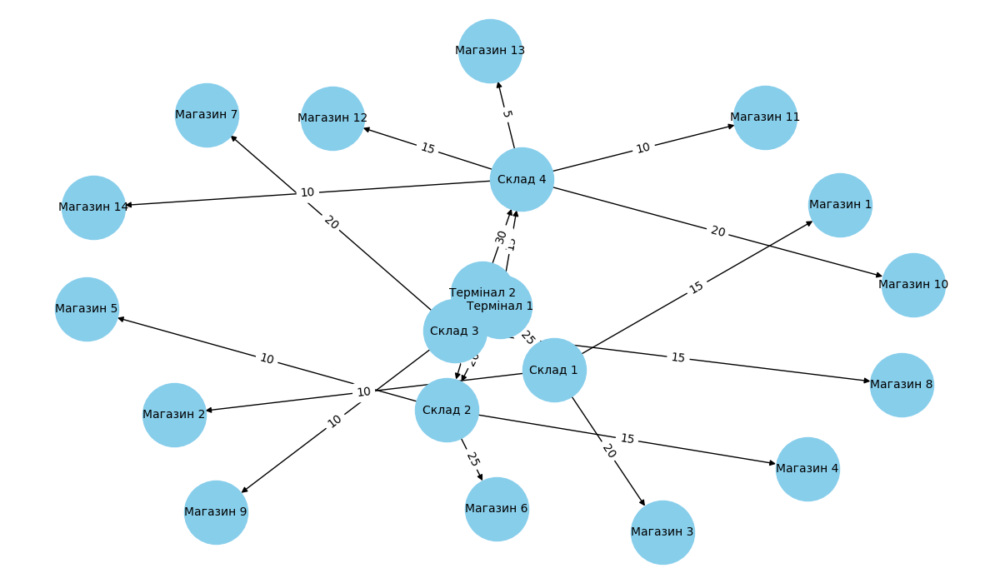
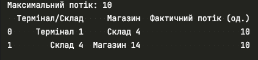

# Logistics Network Flow Analysis

## Overview

This report analyzes the efficiency of a logistics network using the **Edmonds-Karp algorithm** to compute the **maximum flow** from terminals to stores. The network is modeled as a directed graph where **nodes represent terminals, warehouses, and stores**, while **edges represent transportation routes with specific capacities**.

The **maximum flow algorithm** helps identify bottlenecks and determine whether the current infrastructure meets demand.

---

## Logistics Network Structure

The logistics network consists of:
- **Terminals**: Distribution centers where goods originate.
- **Warehouses**: Intermediate storage and distribution points.
- **Stores**: Final destinations for the goods.
- **Edges**: Transportation routes with a limited capacity.

### Network Visualization

The following image represents the **logistics network structure**, including all connections and their capacities.

---

## Computed Maximum Flow

The **Edmonds-Karp algorithm** was applied to the logistics network, resulting in a **maximum flow of 10 units**. This means that **only 10 units of goods can be delivered from terminals to stores under the current infrastructure constraints**.

The computed **actual flow between terminals, warehouses, and stores** is summarized in the table below:

| Terminal/Warehouse | Store | Actual Flow (units) |
|-------------------|-------|--------------------|
| Terminal 1 → Warehouse 4 | Store 14 | 10 |

---

## Analysis of Results

1. **Which terminals supply the most goods to stores?**  
   - **Terminal 1** was responsible for **all** of the delivered goods in this scenario.  
   - **Terminal 2 had no contribution**, suggesting either a lack of available capacity or ineffective routing.

2. **Which routes have the lowest capacity, and how does this affect the total flow?**  
   - The **route between Warehouse 4 and Store 14** had the lowest capacity (10 units), limiting the total possible flow.  
   - This means that **Warehouse 4 became a bottleneck**, preventing more goods from reaching other stores.

3. **Which stores received the least amount of goods, and can their supply be increased?**  
   - **Only Store 14 received deliveries**; all other stores had a flow of **zero**.  
   - Increasing the **capacity of routes from Terminal 1 and Terminal 2 to other warehouses** could distribute the goods more efficiently.

4. **Are there bottlenecks that could be eliminated to improve efficiency?**  
   - **Warehouse 4 is a major bottleneck**—increasing its throughput or **adding alternative routes to other stores** would improve flow.  
   - **Terminal 2 is underutilized**—redirecting goods from Terminal 2 to other warehouses could balance the load and avoid congestion at Terminal 1.

---

## Conclusion

The logistics network, as it stands, **does not efficiently distribute goods to multiple stores**, with all flow being directed toward **Store 14**. The key issues limiting flow include:
- **Underutilization of Terminal 2**
- **Bottleneck at Warehouse 4**
- **Limited capacity on key transportation routes**

